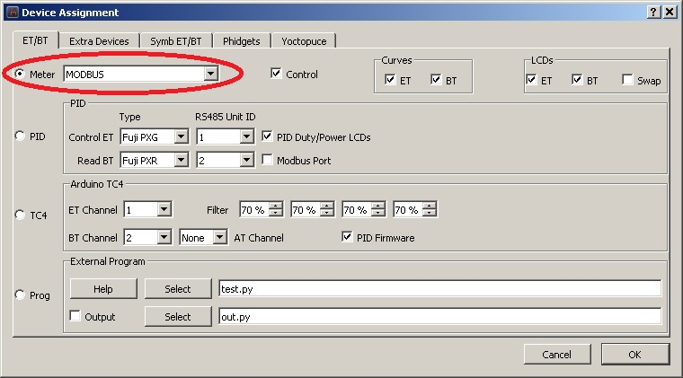
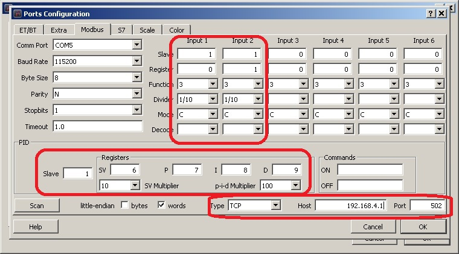
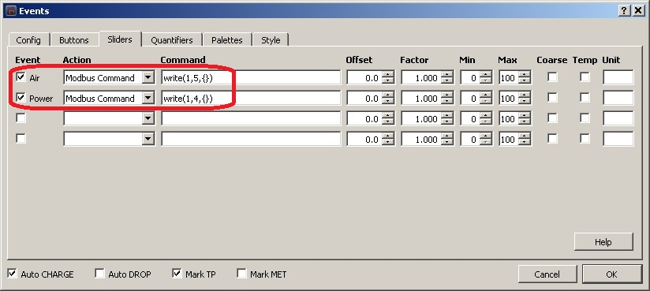

Launch Artisan, and select Device... from Config menu. The dialog below should appear, select ModBus as highlighted below:

Press OK, and the dialog below will appear:

Fill all highlighted areas with the values as in image. The meaning of various settings will be described below:
- Slave 1 - is the ModBus Slave device id of TC4ESP
- Input 1 and 2 are for the two main temperatures, ET (register 0) and BT(register 1) Input 3 and 4 and associated registers 2/3 are reserved for the other two temperatures, if all 4 channels are in use.
- function 3 - read holding register
- divide by 1/10 is required because ModBus send values as integers, 123.4 degrees are sent as 1234, and a division by 10 is required to scale the value correctly\
same for SV of PID
- Mode C or F - select your preferred temperature unit

PID operation also requires setting some registers, for SV and the three coefficients.\
Because PID coefficients can have very small values, under 0.1, a multiplication by 100 is used for same reason as above, to ensure the second decimal is not lost in transmission.

Last area to setup is for the Wifi parameters:
- select TCP from type dropdown
- input 192.168.4.1 as host (TCP4ESP board) IP address, and 502 as ModBus standard port.

Press OK to conclude this dialog

If the TC4ESP was been loaded with a sketch compiled with MODBUS_TCP option selected in user.h, then at start you should see the board IP as part of the splash screen\
If this happens, then you have to instruct the Wifi adapter of the machine running Artisan scan the network, look for "ESP ModBus TCP", and connect to this network. **Warning**: when doing this, the Internet access of the Artisan machine will be lost ! Remember connect your home router when the roasting session ends.\
When all the above are met, press On in Artisan and see temperatures values starting to show.

To activate the manual heater/fan controls, a further and last step is required, select Events... from same Config menu, then Sliders tab, and input the commands required for transmitting the sliders values to TC4ESP via ModBus registers 4 and 5, as in the image below.

If everything was been done right, then you should be able to control heater/fan % using the associated slider in Artisan, and see the effect on TC4ESP display.

Read more about ModBus in Artisan documentation:
https://artisan-scope.org/devices/modbus/
