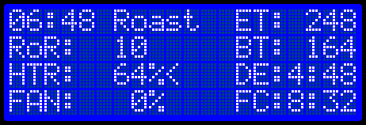

Operating TC4ESP
================

Because in this architecture there could be no pots, due to ESP 8266 lack of ADC, the 4 buttons logic has been changed/improved, in order to replace the pots functionality and also add new features
There are two UI provided, at the moment of first draft only the simple UI is available, the extended UI is still work in progress.

There are some display changes too, listed below, for simple UI:
- the most significant: works on 20x4 displays only
- the AT temperature area was been replaced by a roast phase/mode indicator. In that area you can read the following:\
Roast phase: Idle, Roast, Cool, for simple UI, and more for extended version: Charge, TP, Drying, Yellow, Dev\
Mode: Man of Prof #, alternating with the roast phase above, to show manual mode or the number of profile used
The reason of retiring AT temperature: no more AT sensor, because the TC dedicated amplifiers have have embeded CJC\
- a "<" sign near the HRT or FAN value, showing the target of UP/DOWN buttons control. This pointer can be moved with mode button, during roast only
- the lower right half of display is used now for phase end predictions, Artisan style\
The right half of row 3, where SV is shown during a profile roast, now host the DE prediction during a manual roast\
The right half of row 4, now host either the FC prediction during a manual roast, either DE and FC, flashed alternate, during a profile roast.

Buttons new behaviour in simple UI:
- up/down - control heater or fan, instead pot in manual mode.\
Long press on up/down keys, when heater control is active, are shortcuts for MIN/MID/MAX OT1. No long press effect for FAN control.\
Up key press, in Idle state only, will also start manual roast, with HTR set to MIN_OT1 value, and timer reset.
- enter key - short press toggle PID on-off in profile mode, do nothing in manual mode\
Long press resets timer and start profile, or stop roast in either mode
- mode key, profile browsing and choice, as standard TC4, in Idle phase\
During roast acts as UP/DOWN buttons control toggle, between HTR and FAN, will move the "<" pointer on display.
