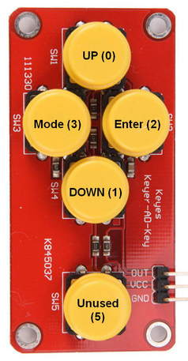

Operating TC4ESP
================

Because this architecture doesn't feature pots, due to ESP 8266 lack of enough ADC channels, the 4 buttons logic has been changed/improved, in order to replace the pots functionality, and also add new features.\

In order to better understand the new UI, first we will meet the buttons layout and meaning:

- up/down - control heater or fan, instead pot in manual mode.\
Use long press on up/down keys, when heater control is active, as shortcut for MIN/MID/MAX OT1.\
No long press effect for FAN control.\
Up key short press, in Idle state only, will start preheat, for a setpoint value depending on beans processing: 170 C for naturals, 180 C for washed. 
This value can be changed during preheat using up/down keys.\

- enter key - short press toggle PID on-off in profile mode, or auto/manual modes, if no profile used;\
short press in Brown(ing) phase signals start of FC and switch to Dev(elopment) phase, startong also DTR specific computations and display;
Long press in idle/preheat/charge phases resets timer and start roast, or stop roast, in roast phases mode.

- mode/settings key: 
in Idle phase switch to a completely new Settings screen, detailed in other document; you can find there profile browsing and choice, as for standard TC4;\
During roast acts as UP/DOWN buttons target toggle, between HTR and FAN. The "<" pointer near the HTR/FAN value serve as a visual hint of which output will be controlled by UP/DOWN buttons.\

Buttons layout and their application codes, for the eBay buttons pad:

There are some display changes, listed below, for the simple UI:
- the most significant: works on 20x4 I2C displays only
- the AT temperature area was been replaced by a roast phase/mode indicator. In that area you can read the following:\
Roast phase: Idle, Roast, Cool, for simple UI, and more for extended version: Charge, TP, Drying, Yellow, Dev\
Mode: Man of Prof #, alternating with the roast phase above, to show manual mode or the number of profile used
The reason of retiring AT temperature: missing sensor, because the TC dedicated amplifiers have have embeded CJC.
- a "<" sign near the HRT or FAN value, showing the target of UP/DOWN buttons control. This pointer can be moved with mode button, during roast only
- the lower right half of display is used now for phase end predictions, Artisan style\
The right half of row 3, where SV is shown during a profile roast, now host the DE prediction during a manual roast\
The right half of row 4, now host either the FC prediction during a manual roast, either DE and FC, flashed alternate, during a profile roast.\
Prediction temperatures are fixed in code, 150 C for DE, and 200 C for FC. If your machine has significant different values, for all bean origins, feel free to change them before load, DE_TEMP and FC_TEMP, in libESP.h

